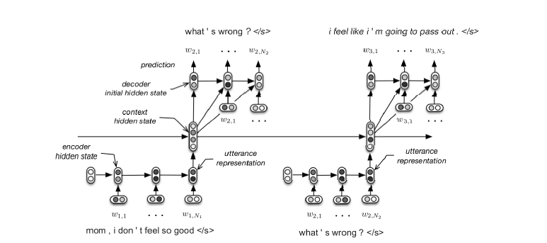
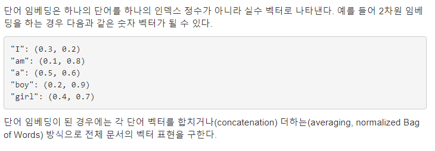

# A Hierarchical Latent Variable Encoder Decoder Model for Generating Dialogues

## 논문 소개

### 개요
- 이 Hierarchical Recurrent Encoder-Decoder NN 모델이 n-gram 대신 최신(!) Neural Language Model로 자리잡을 수 있는 것을 증명하는 논문이다. 
- 이 모델과 비슷한 접근의 한계에 대해 조사할 것임.
- 이것의 성능이 큰 Q-A pair(질문-대답 쌍) corpus와 관련있는 Word Embeddings에서 bootstraping 하는 것으로 배울 수 있는 지 알아 볼 것이다. 

### 소개 1

- 일반적인 대화 시스템은 목적성 시스템과 비목적성 시스템으로 나눠져 있다. 
- 우리가 하려는 것은 "비목적성" 대화 시스템(ex. 언어 학습, 게임 NPC 캐릭터 등..)
- 하지만, 대부분의 배포되어있는 대화 시스템은 수작업으로(...) state와 action feature들을 만들었고 작업을 하기위한 엄청난 관련 자료와 인간이 필요함. 
- 그래서 어쩌구 저쩌구... 해서 비목적성 대화 시스템에 신경망 모델에서 영감을 받았습니다!

### 소개 2 (Generative Model)
- Generative probabilistic model을 기반으로하는 비목적성 대화 시스템의 방향을 잡자. (어떤 Training corpus데서 Emulate 하자)
- 이 모델은 사전에 정의된 상태나 행동 공간에 대한 표현이 필요하지 않음. => Corpus 예재와 함꼐 대화 발화를 대화 상태로 맵핑하는 추론 메커니즘 & 대화 상태를 대화 행동으로 매핑하고 응답 발화에 확률 적으로 매핑하는 동작 생성 메커니즘과 함께 학습뇜.
- 그래서 우리는 HRED를 채택했다..!

### Related work (관련 연구)
- Modeling conversations on micro-blogging websites with generative probabilistic models was first proposed by Ritteret al. (2011).
**발생 가능한 확률 모델을 사용하여 마이크로 블로깅 웹 사이트에서 대화 모델링**
- 응답 생성하는 것에 RNN 적용하는 것을 제안 & 영화 스크립트를 사용해 대화 시스템을 구축하는 것을 제안   
- ex. 하나 이상의 발화를 조건으로하는 모델은 영화 스크립트 데이터베이스를 검색하고 적절한 응답을 검색

### Model
 
- 짧게 요약하면 standard n-gram 을 사용하면 차원의 저주에 걸려버린다. 
- RNN 기반으로 긴 n-gram 문맥을 학습시키는 최신 모델을 사용하면 해결할 수 있다. 

### HRED 1
 
- 각 발화는 dense vector로 인코딩 되고, 다음 번 발화에서 token을 디코딩 하는 데 사용되는 대화 context에 매핑.
- context RNN은 대화 내에서 지금까지 나타나는 발언의 시간 구조를 인코딩하여 정보 및 gradient가 더 긴 시간 범위해서 흐르게 함. 
- 디코더는 RNN 사용해서 한 번에 하나의 토큰 예측!
- 이미 사용자가 제출 한 query가 다음 쿼리를 예측한다. 
- 과거에 제출 된 쿼리의 이력은 두 단계의 순서로 간주됩니다. 즉, 각 웹 쿼리에 대한 일련의 단어와 일련의 쿼리입니다.
- HRED는 두 개의 RNN이있는 시퀀스의 계층 구조를 모델링합니다. (하나는 단어 수준이고 다른 하나는 쿼리 수준)

### HRED 2
- hierarchical recurrent encoder-decoder model (HRED)는 RNN의 확장판.
- encoder-decoder 구조를 대화 생성까지 확장시킨 것.
- 해당 모델은 각각의 output sequence가 두 가지 level의 체계로 만들어질 수 있다고 가정함. 즉, sequences of sub-sequences와 sub-sequences of tokens 두 가지 level로 나눠질 수 있다는 것이다.
- 예를 들어, 대화는 발화들의 sequence(sub-sequence)로 만들어지고 각각의 발화는 단어들의 sequence로 만들어질 수 있다.
- HRED는 세 개의 RNN 모듈 encoder RNN, context RNN, decoder RNN로 구성된다.
- 각각의 단어들의 sub-sequence는 encoder RNN에 의해 실수값을 가지는 vector로 인코딩된다. 문장이 RNN을 통해 인코딩된다는 의미이다.
- 이 인코딩된 값들은 context RNN에 input으로 주어진다. 여러 문장이 있을 때 context RNN은 인코딩된 여러 문장의 vector값을 input으로 받으며, 1~t번째까지의 문장의 모든 정보를 담기 위해 hidden state를 업데이트 하는 것이다.
- context RNN은 실수 값을 가지는 vector를 output으로 출력한다.
- decoder RNN이 다음 문장(sub-sequence of tokens)을 만들어 낼 때, context RNN이 만들어낸 vector를 인풋으로 받는다.

### N-gram 

- N-gram 모델은 확률론적 언어 모형에 속함
- 확률론적 언어 모형(Probabilistic Language Model)은 m 개의 단어 w1,w2,…,wm  열(word sequence)이 주어졌을 때 문장으로써 성립될 확률  P(w1,w2,…,wm)  을 출력함으로써 이 단어 열이 실제로 현실에서 사용될 수 있는 문장(sentence)인지를 판별하는 모형이다. 
- N-gram 모델
- 만약 단어의 활용이 바로 전 n 개의 단어에만 의존한다면 단어 열의 확률은 다음과 같다. 이러한 모형을 N-gram 모형이라고 한다.

## 워드 임베딩
 

-	텍스트를 구성하는 하나의 단어를 수치화 하는 방법의 일종 
-	하나의 단어를 실수 벡터로 나타냄
-	 

논문 결론

- 계층적 RNN 기반 생성 모델이 발화 및 발화 모델을 모델링하는 작업에서 n-gram 기반 모델과 기본 NN모델보다 우수한 성능을 보인다. -> HRED가 좋다!
- 연구를 지원하기 위해 무비 스크립트에 기반한 MovieTriples이라는 새로운 데이터 세트를 소개했습니다.이 데이터 세트는 인간의 언어에 가까운 길고 개방 된 도메인 대화를 모델링하는 데 적합합니다. 반복적 인 계층 구조 외에도, 
- 우리는 퍼포먼스를 향상시키는 데 중요한 두 가지 요소, 즉 퍼가기 단어를 초기화하기 위한 외부 독점 코퍼스의 사용과 커다란 관계가 있지만 비 대화식 코퍼스의 사용을 발견했습니다. 
- 이는 더 큰 대화 데이터 세트의 필요성을 지적합니다. 모든 모델의 경험적 성능은 혼란을 통해 측정되었습니다. 이것은 생성 모델에 대한 확고한 측정이지만, 대화 설정에서 특히 구어체의 또는 비공식적 인 교환으로 인해 발생하는 많은 공통 단어로 인해 발음이 압도 될 수 있습니다. 일반적인 대화 시스템에서 다른 성과 측정 방법을 조사하는 것은 유익 할 수 있습니다. 또한 모델에 의해 생성 된 실제 응답을 고려했습니다.
- MAP 산출물은 다소 일반적인 것이지만 대화가 허용되는 응답을 생성하는 경향이있다. 모델의 확률 적 샘플은보다 다양한 대화를 만들어 냈습니다. 장래의 연구는 트리플 도가 아니라 전체 길이의 대화체 모델을 연구하고 다른 말하기 행동을 모델링하거나 대화 및 실행 작업을 종료해야합니다. 마지막으로, 모델 MAP 결과에 대한 우리의 분석은 오디오와 비디오를 입력하는 대담자와 같은 다른 양식을 포함하여 더 길고 추가적인 상황을 포함하는 것이 유익하다는 것을 암시한다.
